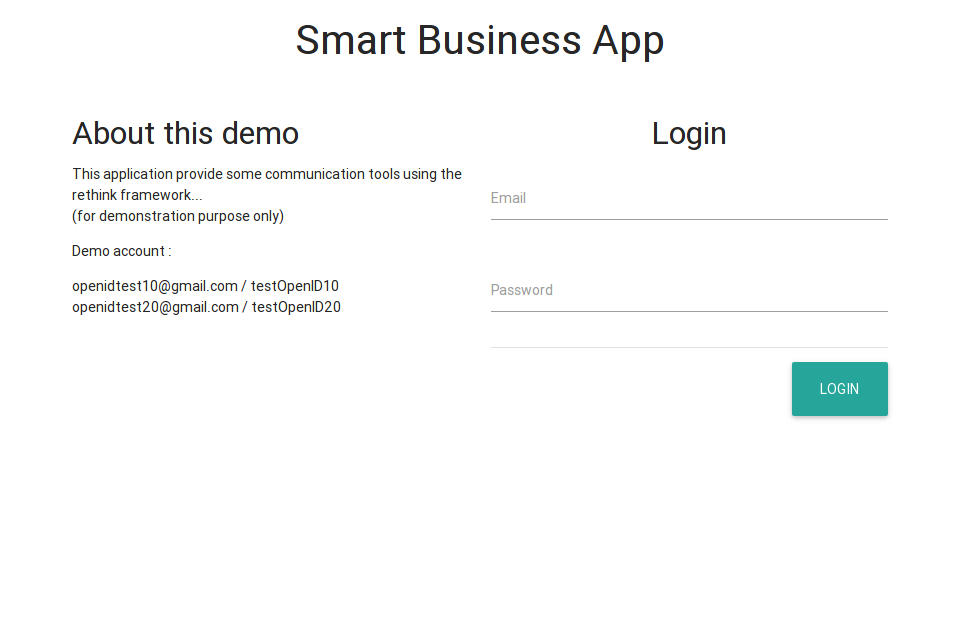
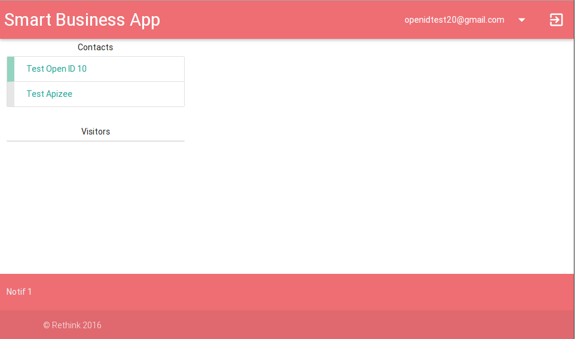
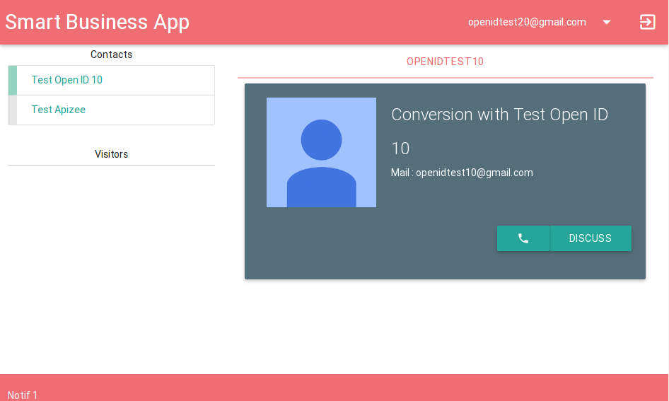
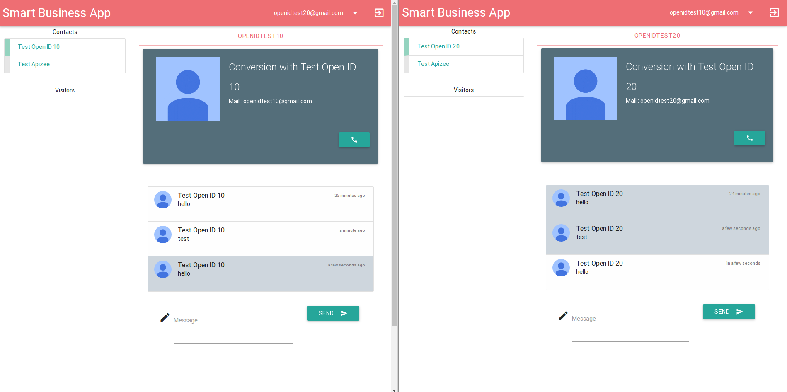
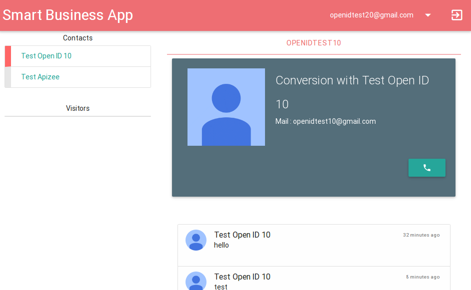
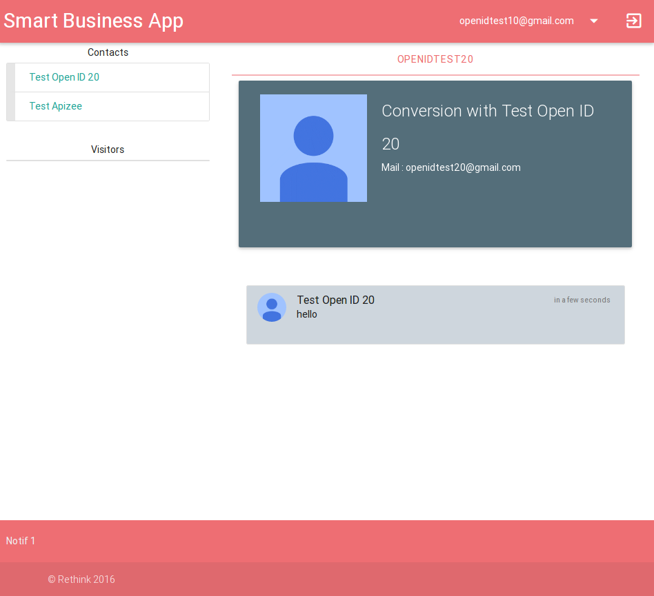
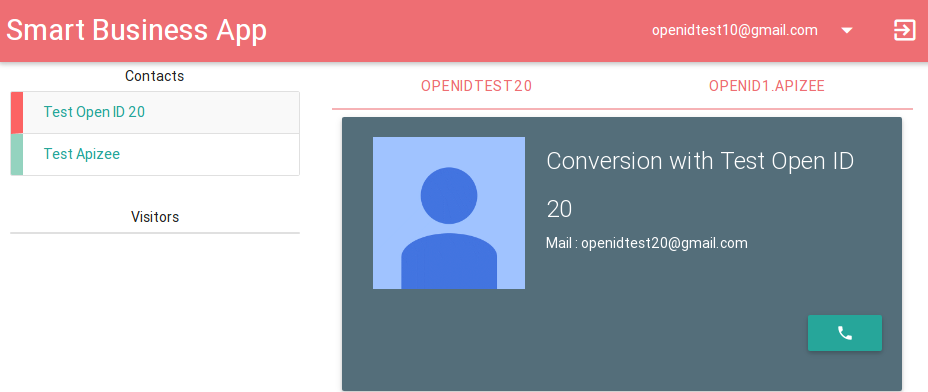
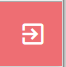

# Smart Business application

## Overview

The Smart Business Application is an example of an application which uses the reThink framework and that could be used inside a company.

Application allows to communicate with other colleagues of the company – internal contact list which is currently hard coded, by chat or video call, seing their presence/availability status.

User may also talk to external people like visitor on the web site of the company.

### User Journey

1. User authenticates to the service. If the user is not logged in, authentication is required.

2. The contact list is displayed. User can see his colleagues presence and availability.

3. User may have a chat with any of the available contacts by clicking on the chat button.

4. The chat is created and both users may exchange chat messages.

5. User can have a video call with any of the available contacts. The availability of the users automatically updates when a user is in call.

The video connector hyperty isn't working properly yet.  
But we can update user state automatically to set as busy when he start a chat or a call.

... or in case of user become unavailable or away, the app disable the specific input on remote user side: like call/chat button, or chat input text.

6. User may have multiple conversation at once.  
User can manage multiple conversation with user from directory or from outside (other enterprise, visitor, etc...) by switching between conversation tabs.

7. At the end of the day, user simply leave application by clicking on the logout button on the top navbar, and be redirecting to login screen.

## Technologies involve

* [Materialize](http://materializecss.com/)
This is a CSS framework based on Google material design concept. It provide a unified experience across platforms and devices sizes.

* [JQuery](https://jquery.com/)
The is the main JS library used in frontend integration in complement of materialize framework.

* [Express.js](http://expressjs.com/)
Express.js is a well know framework use in server side to manage application routing with many http utility & middleware.

## Architecture

*Rethink components*

* Runtime: Exposes two method to app developer: requireHyperty and requireProtoStub. It is the entry point to rethink.
* Hyperties: A hyperty is a service, deployable in a runtime environment [...](https://github.com/reTHINK-project/architecture/blob/master/docs/concepts/Hyperty.md)
* ProtoStubs: The implementation of the protocol stack [...](https://github.com/reTHINK-project/architecture/blob/master/docs/concepts/protofly.md)

This application use the UserStatus hyperty to manage user presence, the GroupChat hyperty for chat exchange, and Connector hyperty for video call.

*Application components*

Web server must serve static file but also handle backend process for application, like user sign-in (if we consider local database account), enterprise info management, etc...

## Run application

### Previous considerations

#### Special folders

*.well-known/runtime*

This folder contains runtime distribution files. They are served along with the application and you need to keep them updated.
**This path is not definitive. The definitive path has to be agreed but we are using this one definitively.**

*resources/descriptors*
This folder contains local descriptors used by RuntimeCatalog-Local. You need to keep them updated and encode your own hyperty into Hyperties.json descriptor.

It currently include descriptor folder content from dev-hyperty repository.

#### Install dependencies

    npm install

### Launch application

    npm start
